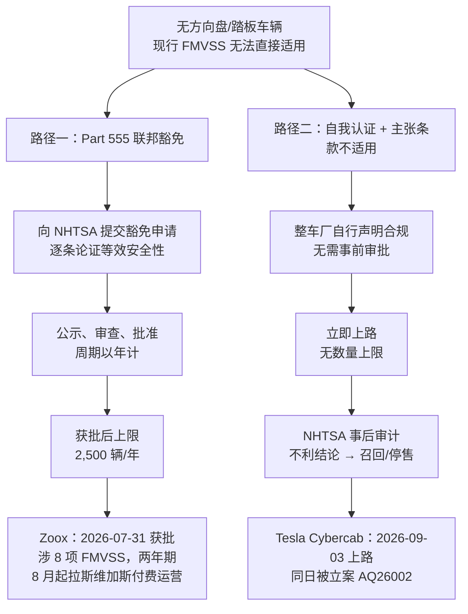

# Tesla Cybercab

Cybercab 是 Tesla 面向 Robotaxi 场景从零设计的双座专用车型，2024 年 10 月发布、2026 年 4 月正式量产，并于 2026 年 9 月 4 日在奥斯汀开始付费载客。它是 Tesla 自动驾驶战略从"改装量产车"走向"专用平台"的转折点，也是美国第一款**以自我认证方式**、而非联邦豁免方式上路的无方向盘车辆——后者使它在上路当天即被 NHTSA 立案审计。

理解 Cybercab 的关键不在于它的硬件参数，而在于三个层面的取舍：**用制造规模换传感器成本**、**用一体化压铸式的"unboxed"工艺换单车成本**、以及**用自我认证换部署上限**。

!!! note "阅读顺序"
    本页聚焦车辆本身与其监管路径。Tesla 的纯视觉理念、FSD 算法演进与 Robotaxi 服务落地历程见 [Tesla FSD](tesla.md)；Robotaxi 行业格局与商业模式对比见 [Robotaxi 商业化](robotaxi.md)。

## 时间线

| 时间 | 事件 |
| --- | --- |
| 2024-10 | 在华纳兄弟片场发布概念车（无方向盘、无踏板，目标售价 < $30,000） |
| 2025-11 | 官方宣布量产时间为 2026 年 Q2 |
| 2026-02 | 首辆量产车在得州超级工厂（Giga Texas）下线 |
| 2026-03 | 测试车出现在硅谷与奥斯汀公开道路 |
| 2026-04 | 正式进入连续生产；Tesla 确认走**自我认证**路线，不受 2,500 辆/年豁免上限约束 |
| 2026-07 | 数百辆整车停放在 Giga Texas 厂区外；Cybercab 被移出"2026 年实现放量生产"的产品清单 |
| 2026-08 | 加装 Starlink 天线；得州注册量约 45 辆 |
| 2026-09-03 | 奥斯汀 ACL Live 举行邀请制发布会；同日 NHTSA 开出审计问询 **AQ26002** |
| 2026-09-04 | 通过 Robotaxi App 在奥斯汀限定区域开始付费载客 |

## 整车设计与规格

Cybercab 取消了一切面向人类驾驶员的部件——方向盘、踏板、外后视镜、后风挡玻璃均不存在。这既是 L4/L5 设计的必然结果，也正是后文监管争议的根源。

| 项目 | 参数 |
| --- | --- |
| 车身形式 | 双门溜背轿跑，蝴蝶门（自动开闭，上掀式） |
| 座位 | 2 座并排 |
| 整备质量 | 1,412 kg（3,113 lb）；最大总质量 1,690 kg，载荷 280 kg |
| 电池 | 48 kWh，4680 电芯，88S6P 拓扑，标称 255.2 V / 146 Ah |
| 电机 | 交流三相永磁同步，163 kW（219 hp），前驱单速 |
| 风阻系数 | < 0.20 |
| 能耗 | 约 103 Wh/km（165 Wh/mile） |
| 续航 | 实验室等效全电续航（EAER）418 mile；EPA 实测约 293 mile（472 km） |
| 充电 | NACS 直流快充；**不支持交流充电**；规划中的车队无线感应充电效率目标 > 90% |
| 计算平台 | AI4（HW4），**非** AI5 |
| 传感器 | 纯摄像头，无激光雷达、无毫米波雷达 |
| 车身覆盖件 | 反应注射成型（RIM），金色本色免喷涂 |
| 设计寿命 | 电池按 80 万 km（50 万 mile）设计 |

几个容易被忽略的工程取舍：

- **48 kWh 是刻意做小的。** Robotaxi 的运营半径由地理围栏决定而非续航，小电池直接降低单车成本与整备质量，代价是依赖高频快充与调度算法配合。
- **不支持交流充电**意味着 Cybercab 从设计上就排除了"家用车"场景——它假定车辆始终归属于一个有直流充电基础设施的车队。这与"车主把私家车接入共享网络"的长期愿景存在张力。
- **前驱单电机**在 Robotaxi 上是成本决策，但也意味着驱动系统没有冗余；对照 [Robotaxi 关键设计要求](robotaxi.md) 中"制动、转向、供电、计算均需双冗余"的行业共识，Cybercab 的冗余方案尚未公开披露。

## 制造：unboxed 工艺

Cybercab 是 Tesla "unboxed process"（拆箱式工艺）的首个落地车型。传统总装线是车身走完涂装后进入一条长线依次装配；unboxed 则把车辆拆成若干大模块并行装配，最后合装，**产线长度约为传统产线的一半**。

| 目标 | 数值 |
| --- | --- |
| 单车生产成本 | < $30,000 |
| 单公里运营成本目标 | < $0.30 |
| 摩根士丹利估算（2025-12） | $0.81 /mile |

爬坡的实际瓶颈不在总装线，而在电芯：**4680 电池产能是近期整车产量提升的主要限制因素**，同一批电芯还要同时供应 Tesla Semi 与 Model Y。2026 年 7 月，即发布会前六周，Tesla 把 Cybercab 从"2026 年实现放量生产"的产品清单中移除；Musk 将爬坡描述为"拉长的 S 曲线"（stretched-out S-curve），称年底前会转入指数段。

!!! warning "产量口径易混淆"
    截至 2026 年 8 月底，得州登记在册的 Cybercab 约 **45 辆**；而 NHTSA 的 AQ26002 审计文件覆盖约 **1,000 辆**。前者是已注册上路的运营车辆，后者是已下线的生产总量——两个数字都被媒体引用为"Cybercab 保有量"，需注意区分。

## 自动驾驶方案

Cybercab 沿用 **AI4（HW4）** 平台而非尚在流片阶段的 AI5，感知为纯视觉，软件栈与量产车共用同一套 FSD V14 端到端模型。

这一选择的含义是：Cybercab 在自动驾驶能力上**并不比一辆装有 AI4 的 Model Y 更强**。它的差异化完全来自车辆形态（成本、空间、无人化设计），而非感知或计算能力。因此 Cybercab 的 L4 可行性，等价于 Tesla 纯视觉 FSD 的 L4 可行性——这个问题在 2026 年 9 月仍未有定论。

- 芯片代际与算力口径详见 [车载计算芯片](../hardware/compute_chips.md)
- FSD 端到端架构演进详见 [端到端自动驾驶](../algorithm/end_to_end.md)

## 监管路径：自我认证 vs 联邦豁免

这是 Cybercab 最具制度意义的部分，也是它与其他无人化车型分道扬镳之处。

美国的车辆准入是**自我认证（self-certification）制度**：整车厂不需要监管机构事前批准，而是自行声明车辆符合全部联邦机动车安全标准（FMVSS），NHTSA 在事后通过调查、审计与召回进行监督。问题在于，现行 FMVSS 是围绕"车里有一个人类驾驶员"这一前提写成的——它要求有方向盘、制动踏板、外后视镜以及驾驶员可及的控制装置。一辆没有这些部件的车，无法用常规方式"符合"这些条款。

面对这一制度空白，两家公司选择了相反的路径：

**Tesla 的选择：** 副总裁 Lars Moravy 确认 Cybercab 走自我认证，Tesla 向 NHTSA 声明该车符合全部适用的 FMVSS——其逻辑是**部分 FMVSS 条款对一辆没有人类控制装置的车"不适用"**。这样做的直接收益是绕开了 Part 555 豁免每年 2,500 辆的数量上限，理论上产量不受监管封顶。

**NHTSA 的回应：** 首批 Cybercab 上路数小时后，缺陷调查办公室（ODI）开出审计问询 **AQ26002**，覆盖约 1,000 辆车。立案文件写明，调查目的是"审查 Tesla 在认证 Cybercab 时所依据的流程与技术数据"，并将评估**其认证在多大程度上建立在'某些联邦机动车安全标准不适用于 Cybercab'这一判断之上**。

**Zoox 的对照组：** 亚马逊旗下 Zoox 的四座对向布局无人车走了完全相反的路——先自我认证，再正式申请 Part 555 豁免。NHTSA 于 2026 年 7 月 31 日批准，成为美国首个获准对无方向盘专用 Robotaxi 收费载客的豁免，涉及 8 项 FMVSS（含风窗除霜、轻型车制动系统等），允许两年内每年最多投放 2,500 辆，8 月起在拉斯维加斯开始付费运营。

两条路径的取舍很清晰：**豁免路径慢但确定，自我认证路径快但把风险后置**。若 AQ26002 的结论认为 Tesla 的"不适用"判断不成立，后果不是罚款而是召回——而召回一款没有方向盘的车，在工程上无法通过 OTA 修复。

!!! note "与中国准入制度的差异"
    中国采用**型式批准（事前审批）**制度，无方向盘车辆需通过专门的准入试点通道。美国的自我认证制度给了 Tesla 这种"先上路、后对簿"的操作空间，这是 Cybercab 路径无法在中国复制的制度原因。相关背景见 [法规与标准](../system/regulation.md)。

## 运营现状与经济性

- **服务范围：** 2026 年 9 月 4 日起在奥斯汀限定地理围栏内通过 Robotaxi App 付费载客，与既有的 Model Y 改装车队共用同一 App 与调度系统
- **车队规模：** 得州注册约 45 辆（2026-08 底），生产总量约 1,000 辆（AQ26002 口径）
- **面向个人销售：** Musk 称将在 2027 年前以不高于 $30,000 的价格向消费者出售，但截至目前**没有 MSRP、没有订购页、没有交付时间表**
- **单位经济性：** 目标 < $0.30/mile；摩根士丹利 2025 年 12 月估算实际约 $0.81/mile。差距主要来自远程监控人力、清洁调度与保险，而非车辆折旧

!!! warning "清洁与调度是被低估的成本项"
    双座封闭舱与蝴蝶门强化了私密性，但也意味着每一次载客后的车内状态无法由司机即时处理。Waymo 与 Zoox 的运营数据都显示，**车内清洁与失物处理构成专用 Robotaxi 单位成本中不可压缩的一块**，Cybercab 尚未公开其解决方案。

## 专用 Robotaxi 平台横向对比

| 维度 | Tesla Cybercab | Zoox | Waymo 第六代（Zeekr RT "Ojai"） |
| --- | --- | --- | --- |
| 车辆来源 | 全新专用平台，自产 | 全新专用平台，自产 | 与吉利极氪联合开发 |
| 人类控制装置 | 无方向盘/踏板/后视镜 | 无方向盘/踏板，双向行驶 | 保留方向盘与踏板 |
| 座位 | 2 座并排 | 4 座对向 | 常规乘用车布局 |
| 传感器 | 纯摄像头 | 摄像头 + 激光雷达 + 毫米波 | 摄像头 + 激光雷达 + 毫米波 |
| 计算平台 | AI4（自研） | 自研 | Waymo Driver（自研） |
| 监管路径 | 自我认证（审计中，AQ26002） | Part 555 豁免（2026-07-31 获批） | 保留控制装置，无需豁免 |
| 部署上限 | 无监管上限，受产能限制 | 2,500 辆/年，两年 | 无监管上限 |
| 付费运营 | 2026-09-04 起，奥斯汀 | 2026-08 起，拉斯维加斯 | 2026-05 起，多城市 |

对比揭示了一个反直觉的结论：**Waymo 之所以能在 2026 年跑出最大的无人车队规模，部分原因恰恰是它保留了方向盘**——第六代 Ojai 车型不触发无控制装置的 FMVSS 问题，因而完全不需要豁免或审计。取消方向盘带来的成本与空间收益是真实的，但它同时把车辆推入了一个尚未完成的监管框架。

## 争议与不确定性

1. **先量产、后自动驾驶。** Cybercab 在无监督 FSD 尚未获得验证时就进入连续生产。Tesla 的赌注是产能先行，一旦软件达标即可瞬间放量；风险是若 FSD 的 L4 可靠性延后，已生产的整车既不能卖给个人（无销售渠道）也不能自主运营。
2. **认证风险不可 OTA 修复。** AQ26002 若得出不利结论，补救手段是召回而非软件更新。
3. **纯视觉的 L4 争议未解。** Cybercab 不改变 Tesla 的感知方案，因此不构成对纯视觉路线的独立验证。
4. **共享网络愿景与车辆设计相悖。** 不支持交流充电、无人类控制装置的车辆，难以纳入"车主闲时出租私家车"的模式。截至 2026 年年中该共享模式仍未启动。

## 参考资料

1. Wikipedia. *Tesla Cybercab*. https://en.wikipedia.org/wiki/Tesla_Cybercab
2. Electrek. *Tesla confirms Cybercab production has started despite delays in unsupervised driving*, 2026-04-23. https://electrek.co/2026/04/23/tesla-cybercab-production-starts-no-nhtsa-2500-vehicle-cap/
3. Electrek. *Tesla Cybercab: mass-producing a car it can't sell or drive itself*, 2026-07-06. https://electrek.co/2026/07/06/tesla-cybercab-production-before-autonomy/
4. Electrek. *Tesla Cybercab is already under NHTSA investigation after launch*, 2026-09-04. https://electrek.co/2026/09/04/tesla-cybercab-nhtsa-investigation-fmvss-certification/
5. TechCrunch. *Feds launch investigation into Tesla's Cybercab deployment*, 2026-09-04. https://techcrunch.com/2026/09/04/feds-launch-investigation-into-teslas-cybercab-deployment/
6. NHTSA Office of Defects Investigation. Audit Query AQ26002, 2026-09-03.
7. Engadget. *Amazon's Zoox is the first steering wheel-free robotaxi to get regulatory approval for paid rides*, 2026-07-31. https://www.engadget.com/2227649/amazon-zoox-first-steering-wheel-free-robotaxi-regulatory-approval-paid-rides/
8. Electrive. *Zoox receives approval for paid robotaxi services*, 2026-07-31. https://www.electrive.com/2026/07/31/zoox-receives-approval-for-paid-robotaxi-services/
9. Motor1. *Tesla Cybercab Finally Reveals Key Specs—Including 418 Miles Of Range*, 2026. https://www.motor1.com/news/798917/tesla-cybercab-specs-small-cars/
10. The Motley Fool. *Tesla Launched the Cybercab Thursday, 6 Weeks After Removing Volume Production of It From This Year's Plan*, 2026-09-04. https://www.fool.com/investing/2026/09/04/tesla-launched-the-cybercab-thursday-6-weeks-after-removing-volume-production-of-it-from-this-year-s-plan/
